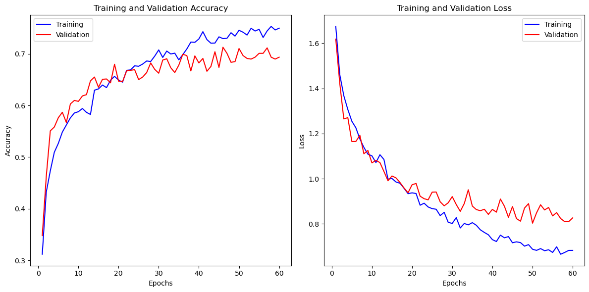

# FSI Convolutional Neural Networks

A Convolutional Neural Network (CNN) is a type of Deep Learning neural network architecture designed for processing structured grid-like data. This neuronal network is powerful for tasks related to image and video analysis, but it can be applied to other types of data like audio recognition, natural language processing...

## CNN Architecture

- The **Convolutional** layer utilizes filters on the input image to extract distinct features
- **RELU**(Rectified Linear Unit) is an activation function known for its computational efficiency and simple training process, as it doesn't suffer from saturation issues.
- The **Pooling** layer reduces the image size for computational efficiency.
- The **Fully connected** layer generates the ultimate prediction. 
- The **Flatten** operation transforms multidimensional arrays into a one-dimensional array.
- **Softmax** is an activation function that normalizes the output of a neural network into a probability distribution over multiple classes.

The network refines its filters using backpropagation and gradient descent to achieve optimal learning.

  
Source: http://cs231n.stanford.edu/

## VGG16

VGG16 is a specific neural network architecture with 16 layers, known for its effectiveness in image recognition. Developed by researchers at the University of Oxford, it gained fame for its simplicity and high accuracy in classifying objects within images during the 2014 ImageNet challenge. The network uses a series of convolutional and pooling layers, making it proficient at learning complex image features

### VGG16 Architecture

  
Source: https://www.geeksforgeeks.org/vgg-16-cnn-model/

The VGG16 architecture is a neural network comprising 16 layers, primarily stacked with convolutional layers and followed by pooling layers. Its design focuses on using smaller 3x3 convolutional filters throughout, resulting in a deeper network capable of learning complex image features. This structure gained prominence for its simplicity and effectiveness in accurately classifying objects within images, especially in the ImageNet challenge of 2014.

## 🐈 Animal Classifier

An animal categorizer denotes a structure or pattern that has the ability to organize or group animals depending on specific traits or attributes. It generally involves employing machine learning or recognizing patterns, allowing the structure to acquire knowledge from information to differentiate among diverse animal categories or types.

### 📂 Dataset

The dataset used in this project was sourced from Kaggle, available via the provided [link](https://www.kaggle.com/datasets/alessiocorrado99/animals10). Six out of the original ten classes were selected, and the quantity was adjusted to 1346 images per category. In the testing phase, the standardization reached 118 files per category. Nevertheless, variations in sizes persist due to differences in image quality.

The diversity in dataset qualities has the potential to impact various aspects, including the model's complexity, generalization capability, preprocessing requirements, and training duration.

#### Image complexity

The dataset holds complexity, as we may encounter cases that can be confusing and contradictory. Here are 2 examples of images from the training set:
In the first one, we observe an image belonging to the cat class, which also features a butterfly. This situation may lead to class overlap. In the second image, it's labeled as an elephant; however, there isn't one present in the image.

### 🎯 Training

### Efficiency Table Without Pretrained models

Image size = 150  
Optimizer = Adam  
Learning rate = 1e-3  

Number Of Layers|Number Of Neurons Per Layer|Activation Function|DropOut|Accuracy|Loss|
|:---|:---|:---|:---|:---|:---|
| 4 | 16, 32, 64, 6 | relu, softmax | 0.4, 0.3, 0.5 | 0.5123 | 1.2321 |
| 2 | 32, 6 | relu, softmax | 0.5 | 0.4314 | 1.3908 |
| 5 | 32, 64, 64, 32, 6 | relu, softmax | 0.3, 0.4, 0.3, 0.4 | 0.6132 | 1.1009 |
|3| 32, 128 6 | relu, softmax | 0.25, 0.5 | 0.6029 | 1.1043 |
|4| 32, 64, 128, 6 | relu, softmax | 0.25, 0.25, 0.5 | 0.7139 | 0.7603 |
|4| 32, 32, 64, 6 | relu, softmax | 0.2, 0.2, 0.5 | 0.7100 | 0.8033 |

### Efficiency Table Using VGG16

Image size = 224  
Optimizer = Adam  

Number Of Layers|Number Of Neurons Per Layer|Activation Function|DropOut|Learning rate|Accuracy|Loss|
|:---|:---|:---|:---|:---|:---|:---|
|2| 512, 6 | relu, softmax | 0.5 | 1e-3 | 0.8664 | 0.3985 |
|2| 32, 6 | relu, softmax | 0.2 | 1e-4 | 0.8664 | 0.3985 |
|2| 32, 6 | relu, softmax | 0.4 | 1e-4 | 0.8771 | 0.39856 |

### Comparation

#### CNN without VGG16

#### Using VGG16

In the training of the network without VGG16, we can observe that it starts at around 0.45% and finishes at approximately 70%. On the other hand, its final loss is about 0.79. When compared to VGG16, it is evident that the latter outperforms it both in accuracy (reaching approximately 85%) and in loss (approximately 0.4)

### Test comapartive

#### Test without VGG16

45/45 [==============================] - 5s 115ms/step - loss: 0.9265 - accuracy: 0.6638  
Test Loss: 0.926513135433197  
Test Accuracy: 0.6638417840003967

#### Test VGG16

45/45 [==============================] - 8s 172ms/step - loss: 0.3620 - accuracy: 0.8686  
Test Loss: 0.3619837760925293  
Test Accuracy: 0.8686440587043762

Comparing these test results, we observe a substantial difference in performance between the models. The test with VGG16 achieved significantly lower loss and higher accuracy compared to the test without VGG16. The model utilizing VGG16 architecture demonstrated superior performance, showcasing lower loss and higher accuracy on the test dataset.